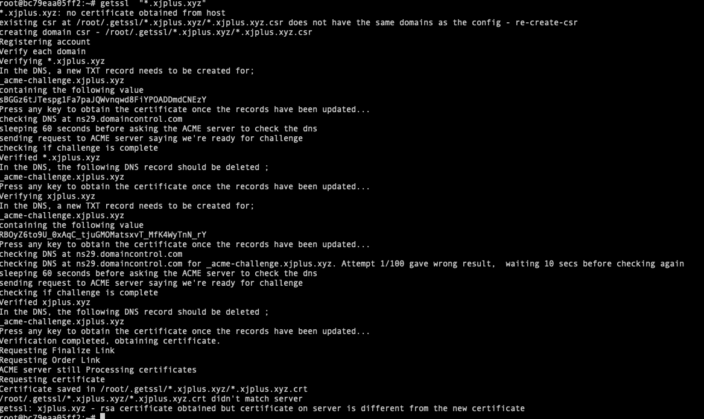

## Let's encrypt with getssl

### Wiki
- https://github.com/srvrco/getssl?tab=readme-ov-file#rpm-based-packages-redhat-centos-suse-oracle-linux-aws-linux

### Steps - instructions for generating certificates with getssl manually
```shell
#1 start docker container
docker run -it --rm ubuntu:22.04 bash
#2 install required packages
apt update -y
apt install -y wget curl dnsutils ca-certificates vim
cd ~
#3 install getssl
wget https://github.com/srvrco/getssl/releases/download/v2.49/getssl_2.49-1_all.deb
dpkg -i getssl_2.49-1_all.deb
getssl --help
#4 configure getssl & change the config
getssl -c "*.xjplus.xyz"
vim .getssl/\*.xjplus.xyz/getssl.cfg
    CA="https://acme-v02.api.letsencrypt.org"
    SANS="xjplus.xyz"
    VALIDATE_VIA_DNS="true"
    USE_SINGLE_ACL="true"
    FULL_CHAIN_INCLUDE_ROOT="true"
    DNS_ADD_COMMAND="/usr/share/getssl/dns_scripts/dns_add_manual"
    DNS_DEL_COMMAND="/usr/share/getssl/dns_scripts/dns_del_manual"
#6 generate certificate
getssl "*.xjplus.xyz"
#7 follow the hints to add / delete TXT records
#8 verify the TXT record
nslookup -type=txt  _acme-challenge.xjplus.xyz
#9 view the certificates
ll .getssl/\*.xjplus.xyz/
#10 copy to local host
docker cp bc79eaa05ff2:/root/.getssl/\*.xjplus.xyz/ ~/Downloads/

#11 aws 上传证书
*.xjplus.xyz.crt
*.xjplus.xyz.key
fullchain.crt
```

##### The screenshot

